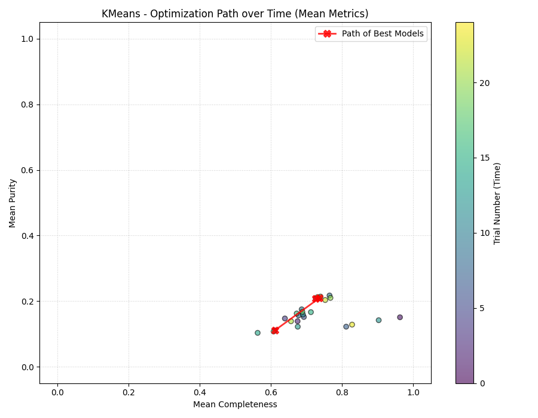
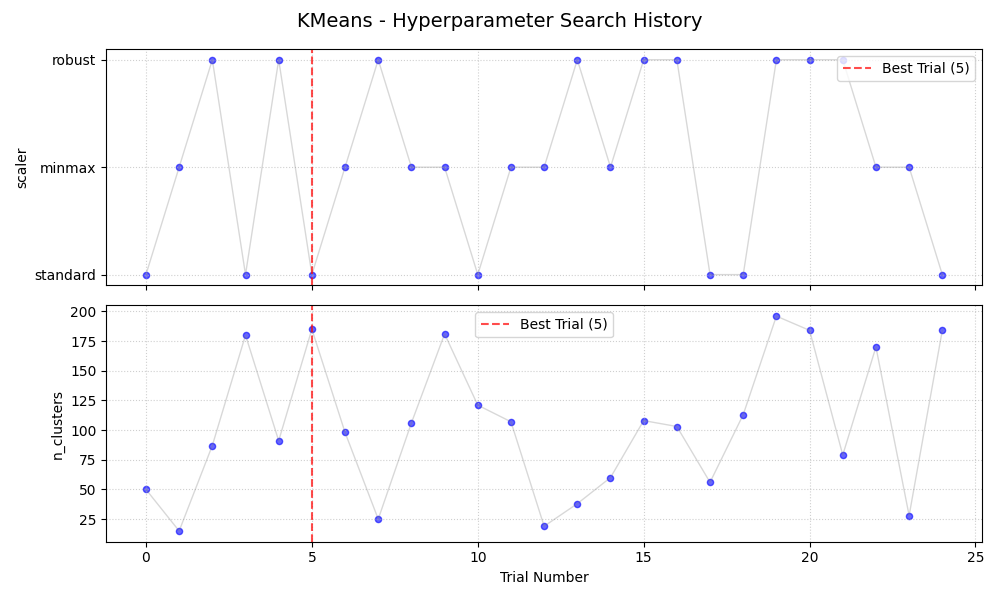
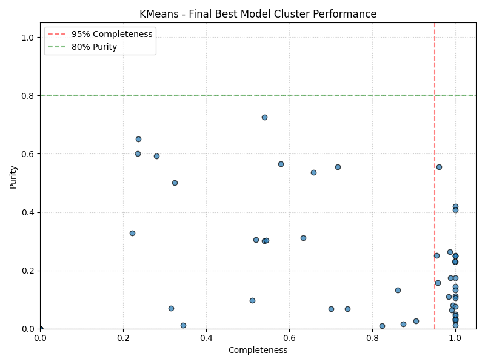
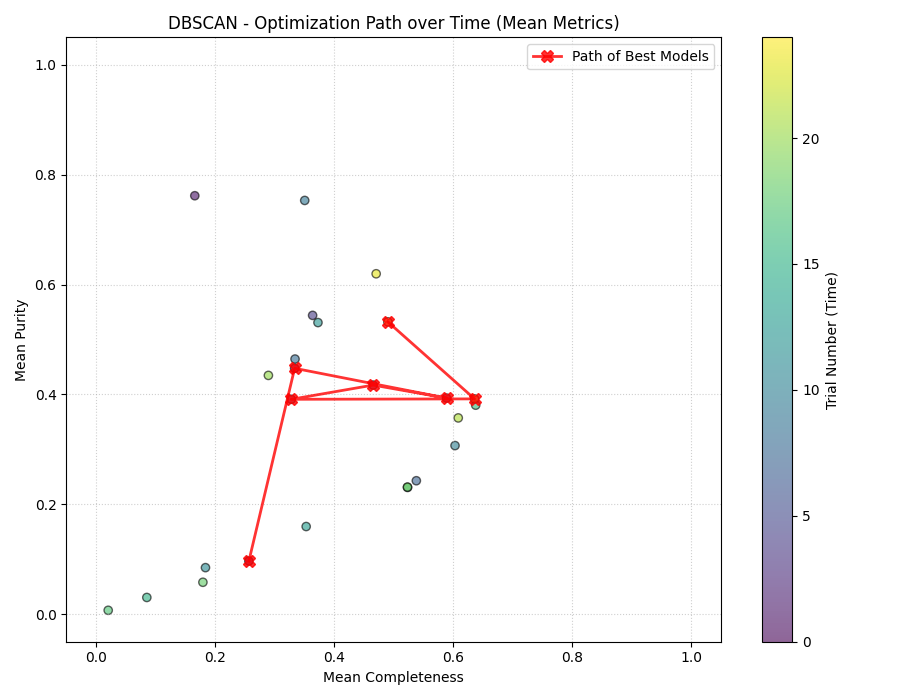
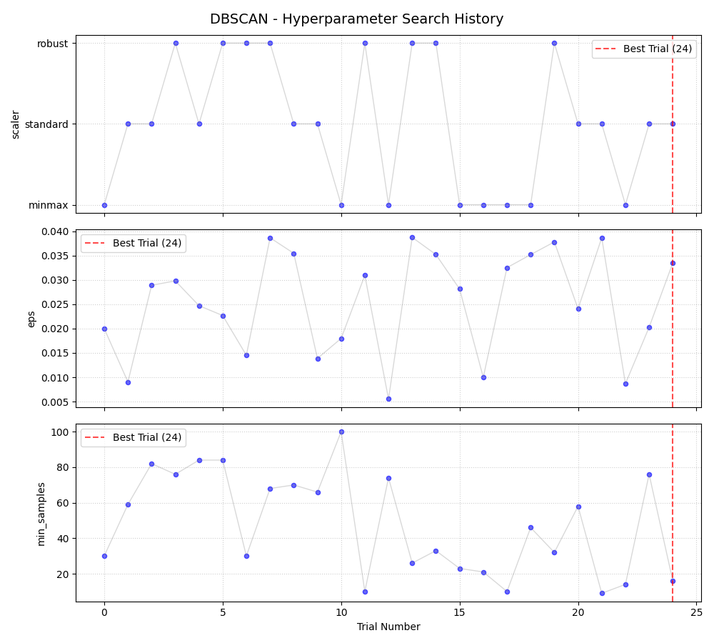
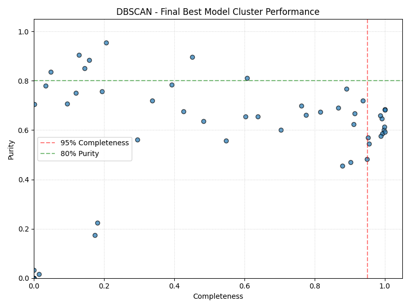
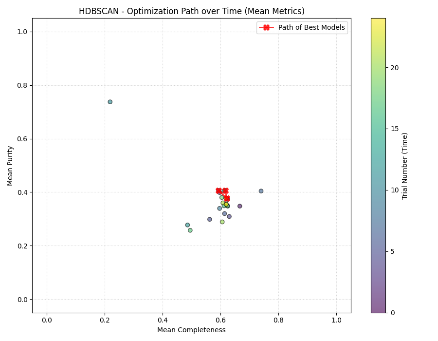
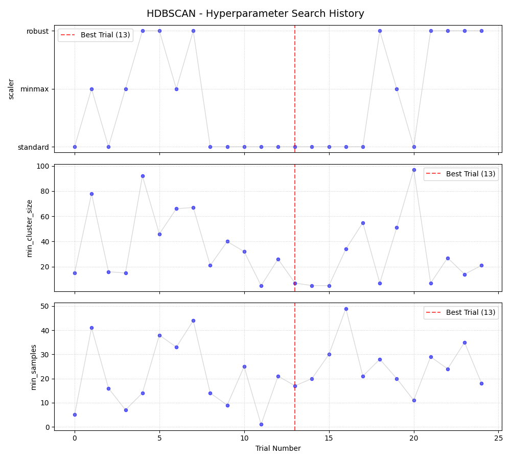
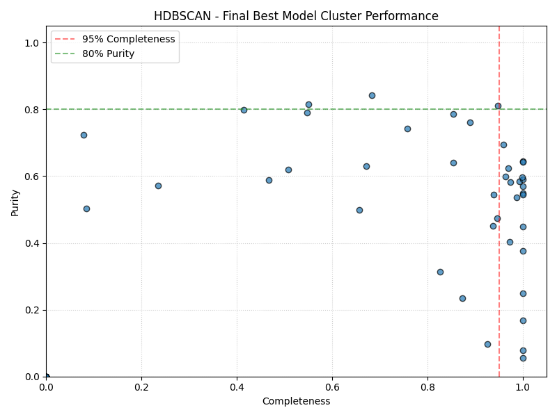

# Project 2: Asteroid Families!
**Author**: Dhvan Shah

**Paper**: Hirayama, K. (1919). *"Groups of Asteroids Probably of Common Origin"*

## Project Overview
This project focuses on multi-dimensional unsupervised machine learning. The goal is to develop an algorithmic pipeline capable of automatically identifying asteroid families by clustering them based on their orbital parameters. 

Rather than relying on visual approximations or basic 2D models, this software evaluates its efficacy against a comprehensive benchmark of real, vetted data.

### The Challenge of Asteroid Detection
Identifying true asteroid families is an inherently noisy problem. In phase space, asteroids are constantly subjected to planetary perturbations. To accurately cluster these bodies, we must rely on stable, long-term indicators of shared origin rather than transient positions:

* **Proper vs. Osculating Elements**: The pipeline strictly uses proper elements (semi-major axis `a`, eccentricity `ecc`, and sine of inclination `sinI`). Osculating elements fluctuate too rapidly due to gravitational interactions with planets to reliably indicate historical collisional origins.
* **Proper Frequencies**: Secular frequencies (`g` and `s`) are incorporated. Family members cluster tightly in frequency space, providing a crucial signal to differentiate true family structures from the dense fog of background objects.
* **Data Integrity**: The phase space is littered with observational errors. Rows flagged with non-zero Quality Flags (`RFL`, `QCM`, `QCO`) are filtered out before scaling to ensure the model only trains on reliable telemetry.

## Benchmark
The primary benchmark for this project is to identify at least eight asteroid families to a 95% completeness threshold. 

### Benchmark Metrics
I validate my clustering against the standard asteroid families defined by the AstDys group, founded by A. Milani. The evaluation relies on two primary metrics:
1. **Completeness (Recall)**: The percentage of true AstDys family members successfully grouped into a single algorithmic cluster. The benchmark target is >= 95%.
2. **Purity (Precision)**: The percentage of a generated cluster that consists of true family members. While completeness is the primary benchmark, high purity (>= 80%) is required to ensure the algorithm isn't simply dumping all asteroids into massive, mathematically meaningless mega-clusters.

## The Optimization Strategy
Asteroid families are not uniform. Some, like the Eos family, are massive and dense; others are highly diffuse or sparsely populated. Because of this extreme variance in density and volume within the phase space, manually hardcoding hyperparameters is ineffective. A radius or density requirement that perfectly captures a sparse family will inevitably merge two dense, distinct families together.

To solve this, I engineered an automated hyperparameter search pipeline using `Optuna`. The optimizer executes trials for each algorithm, evaluating them against a custom objective function designed to aggressively penalize low-purity "mega-clusters" while rewarding high completeness:

Score = Σ (Completeness * Purity^3)

**Dynamic Feature Scaling:**
Clustering algorithms rely heavily on spatial distance metrics, meaning the scale of the features drastically impacts cluster formation. Because orbital elements (like `a`) operate on a different scale than frequencies (like `g`), Optuna was also tasked with selecting the optimal scaling algorithm for each model, dynamically choosing between `MinMaxScaler`, `StandardScaler`, and `RobustScaler` during the search.

### Computational Resources & The Unity Supercluster
Scaling this dataset and executing hundreds of clustering trials requires significant processing power. To achieve this, the hyperparameter tuning was executed on the Unity cluster of the Massachusetts Green High Performance Computing Cluster. 

By utilizing 64 cores and 64GB of memory on the supercomputer cluster, the Optuna optimization studies were parallelized to rapidly map the phase space contours. The codebase provided in this repository utilizes the *saved model files* generated from that tuning process. Running the code locally simply evaluates these pre-computed models; it will not force your local machine to rerun the exhaustive supercluster tuning.

## Algorithm Exploration & Analysis

### 1. KMeans Clustering (The Baseline)
KMeans assumes that clusters are roughly spherical and have similar variance. Asteroid families, however, are often elongated in proper element space due to the physics of their initial collisional dispersion.



**Optimization Path:** The solver completely struggles to maximize the objective function. The path of best models (red line) is trapped in a low-purity domain, failing to cross 0.25 mean purity.



**Hyperparameter History:** Optuna's best attempt was Trial 5, settling on the `StandardScaler` and ~185 clusters. However, the search path was highly erratic, indicating the model architecture fundamentally doesn't fit the data shape.



**Final Performance:** As expected, KMeans fails the benchmark. While a vertical line of clusters reaches near 100% completeness, their purity is effectively zero. The algorithm simply lumped distinct families and background objects together into massive spheres.

### 2. DBSCAN (Density-Based Spatial Clustering)
DBSCAN is a massive theoretical upgrade for this dataset. Instead of assuming spherical clusters, it groups core samples of high density and expands outward, natively filtering out low-density background asteroids as "noise." 



**Optimization Path:** By dynamically adjusting the density thresholds and scaler combinations, the solver pushed the mean purity of the models significantly higher than KMeans, stabilizing around a mean purity of 0.5.



**Hyperparameter History:** The best configuration was Trial 24. Optuna favored `MinMaxScaler`, isolating an optimal radius (`eps` ≈ 0.034) and a core density requirement (`min_samples` ≈ 18). 



**Final Performance:** DBSCAN performs much better than KMeans but still falls short of the ultimate goal. While it pushes several clusters to the 95% completeness line (red dashed), the maximum purity for those clusters sits around 68-70%. It fails to cross both the 95% completeness and 80% purity thresholds simultaneously. This highlights DBSCAN's primary weakness: it relies on a *single, global* `eps` value, making it impossible to perfectly isolate both highly dense and highly diffuse families at the exact same time.

### 3. HDBSCAN (Hierarchical DBSCAN)
HDBSCAN theoretically solves the fundamental flaw of standard DBSCAN. By building a hierarchical density tree and extracting flat clusters based on their stability across varying density thresholds, it can isolate both tight, dense asteroid clusters and broader, sparse families simultaneously.



**Optimization Path:** The solver rapidly stabilizes. Rather than wildly swinging across the metric space, it quickly converges on a tight cluster of highly optimized mean scores around 0.6 completeness and 0.4 purity.



**Hyperparameter History:** Trial 13 proved optimal, favoring the `StandardScaler` over `MinMax` or `Robust`. It settled on a very tight `min_cluster_size` (≈ 7) and `min_samples` (≈ 17). 



**Final Performance:** While HDBSCAN is the most mathematically robust model here, it still hits a performance ceiling. Looking at the final scatter plot, HDBSCAN pushes several clusters to the 95% completeness line, but their purity maxes out near 70%. It does not successfully get any clusters into the target >95% Completeness / >80% Purity quadrant. This suggests that while hierarchical density clustering is a major improvement, purely distance-based clustering on these five proper elements may not be enough to perfectly disentangle overlapping families in phase space without further feature engineering.

## Capabilities & Limitations
### Capabilities
- **Automated Tuning Pipeline**: The abstract `OptunaAlgorithm` class allows for the rapid integration and optimization of any clustering algorithm without rewriting evaluation logic.
- **Mathematical Benchmarking**: The pipeline implements the Hungarian algorithm (`linear_sum_assignment`) to automatically find the optimal mathematical mapping between predicted clusters and the AstDys benchmark families.
- **Dynamic Preprocessing**: Models automatically test and apply optimal data scaling techniques (`MinMax`, `Robust`, `Standard`) during tuning to ensure spatial distance metrics remain valid.

### Limitations
- **Background Noise Penalty**: Density-based models classify sparse background asteroids as noise (-1). The current contingency matrix logic treats "Noise" as a single cluster, which can skew global purity metrics if not properly isolated during analysis.
- **Library Constraints**: This advanced pipeline utilizes `optuna` and `hdbscan`. While powerful, these require careful environment management as they extend beyond the standard allowed computing libraries.

## File Structure
- `main.py`: Execution script that initializes the models and loads the optimal weights.
- `algorithms/algorithm.py`: Abstract base class handling data ingestion and the contingency matrix benchmarking logic.
- `algorithms/optuna.py`: Extends the base algorithm to execute the hyperparameter search, score the objective function, and generate the matplotlib evaluation figures.
- `algorithms/kmeans.py`, `dbscan.py`, & `hdbscan.py`: Concrete implementations defining the hyperparameter search space for each specific mathematical model.
- `raw_data/`: Contains the AstDys `asteroids.csv` and `families.csv` reference files.
- `figures/`: Output directory for generated performance charts.

## Usage

### Requirements
* **Python 3**
* Install dependencies:
    ```bash
    pip install pandas numpy scikit-learn scipy optuna matplotlib plotly hdbscan
    ```

### Running the Pipeline Locally
To execute the pipeline and view the supercluster-optimized results on your machine:
1. Clone the repository:
    ```bash
    git clone https://github.com/olincollege/scicomp-p2-Dh-Van.git
    ```
2. Ensure `reload_raw_data=False` in your `main.py` instantiation so the system knows to load the cached, optimized model states (`.pkl` files) instead of launching a new optimization study.
3. Execute the main script:
    ```bash
    python main.py
    ```
